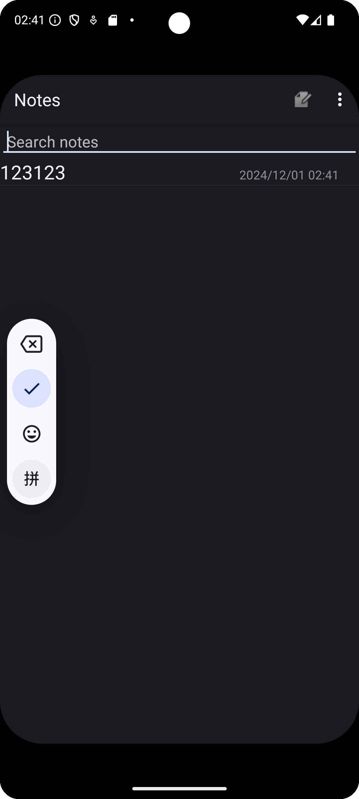
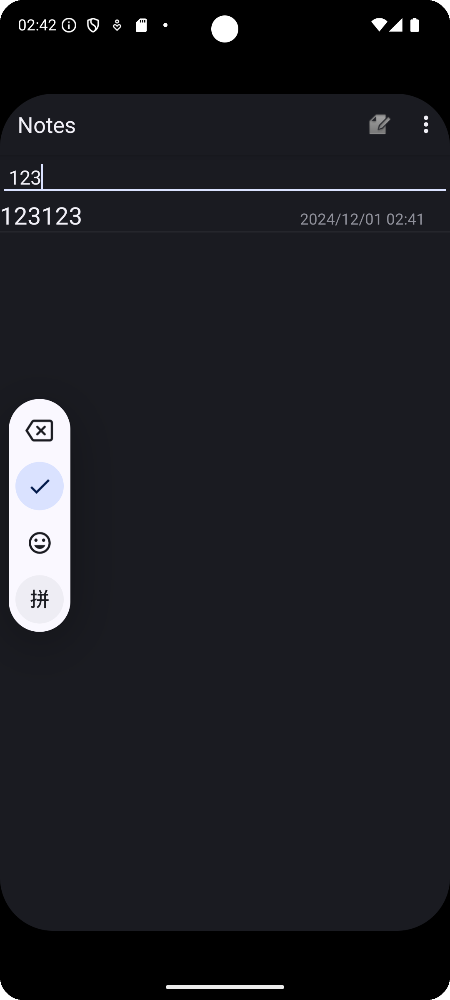

# NotePad - Android 便签应用

### 简介

#### NotePad 是一个简单的 Android 便签小应用 , 用户可以轻松地添加、删除、搜索和管理便签内容。它支持便签标题和内容的修改、字体大小和颜色的更改

- NotePad主页面如图所示

## 拓展功能特性

###   标签目录具有时间戳：能更方便地查看便签的更新时间。

设置布局文件，嵌套线性布局
将title和时间绑定在ListView中

    <LinearLayout xmlns:android="http://schemas.android.com/apk/res/android"
        android:layout_width="match_parent"
        android:layout_height="wrap_content"
        android:orientation="horizontal">
    
        <TextView
            android:id="@android:id/text1"
            android:layout_width="0dp"
            android:layout_height="wrap_content"
            android:layout_weight="2"
            android:textAppearance="?android:attr/textAppearanceLarge"
            android:singleLine="true" />
    
        <TextView
            android:id="@android:id/text2"
            android:layout_width="0dp"
            android:layout_height="wrap_content"
            android:layout_weight="1"
            android:textAppearance="?android:attr/textAppearanceSmall"
            android:singleLine="true" />
    </LinearLayout>

在PROJECT中添加关于更新时间的请求

        private static final String[] PROJECTION = new String[] {
            NotePad.Notes._ID, // 0
            NotePad.Notes.COLUMN_NAME_TITLE, // 1
            NotePad.Notes.COLUMN_NAME_MODIFICATION_DATE
        };

-

      String[] dataColumns = { NotePad.Notes.COLUMN_NAME_TITLE ,NotePad.Notes.COLUMN_NAME_MODIFICATION_DATE} ;
      // The view IDs that will display the cursor columns, initialized to the TextView in
      // noteslist_item.xml text2笔记列表显示笔记条目的时间戳
      int[] viewIDs = { android.R.id.text1,android.R.id.text2 };

但要注意的是，此时数据库返回的时间不是我们常用的日期格式，因此需要转化

    adapter.setViewBinder(new SimpleCursorAdapter.ViewBinder() {
                @Override
                public boolean setViewValue(View view, Cursor cursor, int columnIndex) {
                    if (columnIndex == cursor.getColumnIndex(NotePad.Notes.COLUMN_NAME_MODIFICATION_DATE)) {
                        long timestamp = cursor.getLong(columnIndex);
                        String formattedDate = new SimpleDateFormat("yyyy/MM/dd HH:mm", Locale.getDefault())
                                .format(new Date(timestamp));
                        ((TextView) view).setText(formattedDate);
                        return true;
                    }
                    return false;
                }
            });

### 搜索便签：通过搜索栏快速查找特定的便签。

#### 初始化搜索栏的控件

